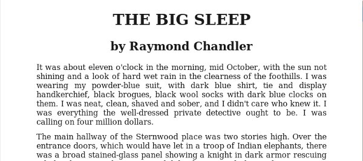
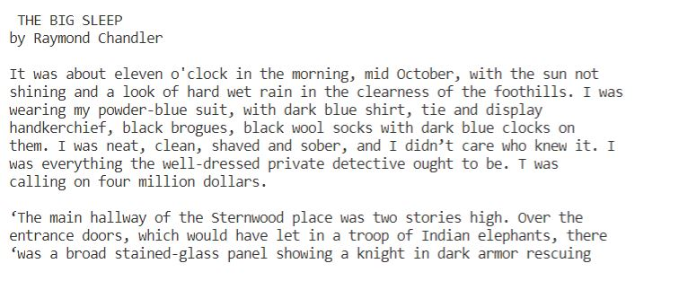
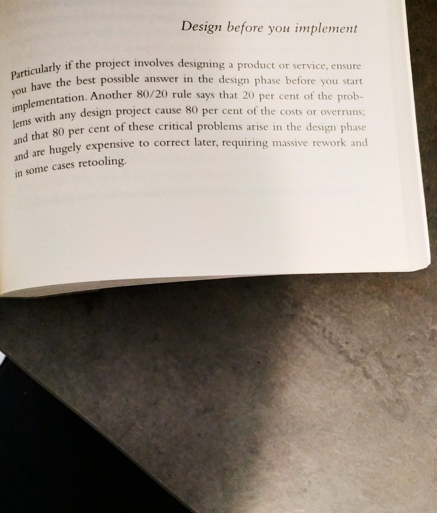
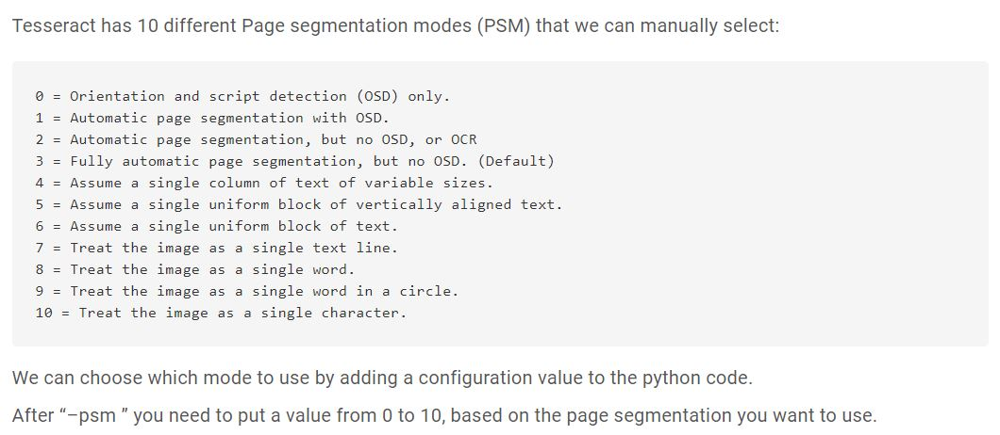

# Optical Character Recognition OCR System

Using OpenCV and PyTesseract to extract text from images.

## Requirements:

1- Tesseract

2- PyTesseract

3- OpenCV

4- numpy

## Project Overview:

**Input 1 - textimg.jpg**

**Output**

You can see the extracted text is 100% accurate since the image was really clear.

**Input 2 - book_page.jpg**

**Output**

The output is approx. 80% correct due to presence of noise in the image. It can be improved by doing preprocessing of the image more thoroughly and by changing the ocr configurations.

The default mode is mode 3 which is used in this project.

The extracted text can now be used to detect sentiment and other related tasks can be performed.
